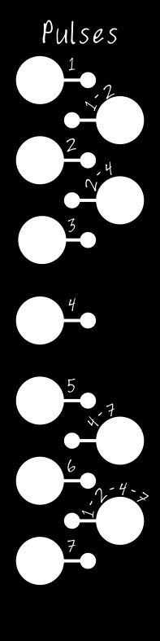

# KosmoPulse
 Music Thing Modular Pulse Expander for the Turing Machine converted to Kosmo Format

 

  

[Schematic](https://github.com/TomWhitwell/Turing-Pulse-Expander/blob/master/Collateral/pulses_rev2_schematic.pdf)

Status:   
June 2022 - Boards have not been manufactured or tested

License:  
[CC-BY-SA](https://creativecommons.org/licenses/by-sa/3.0/) 